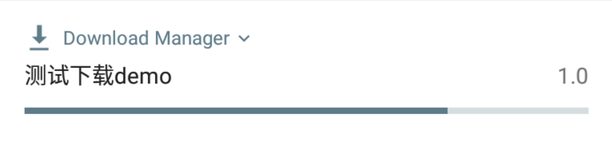
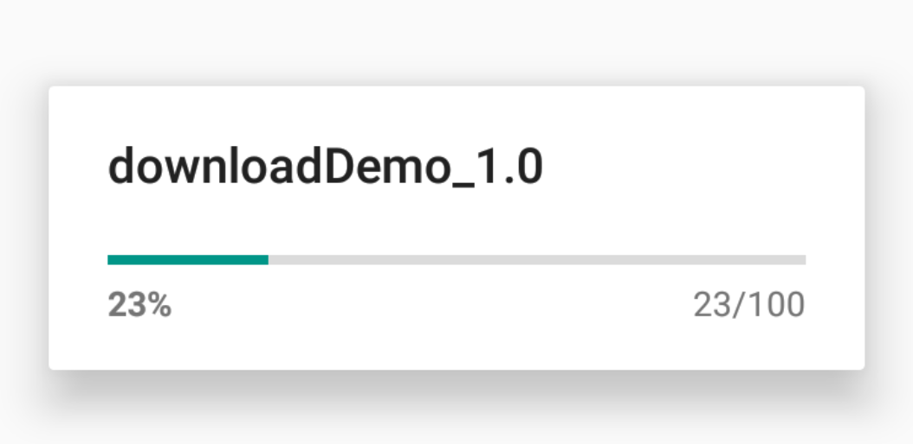
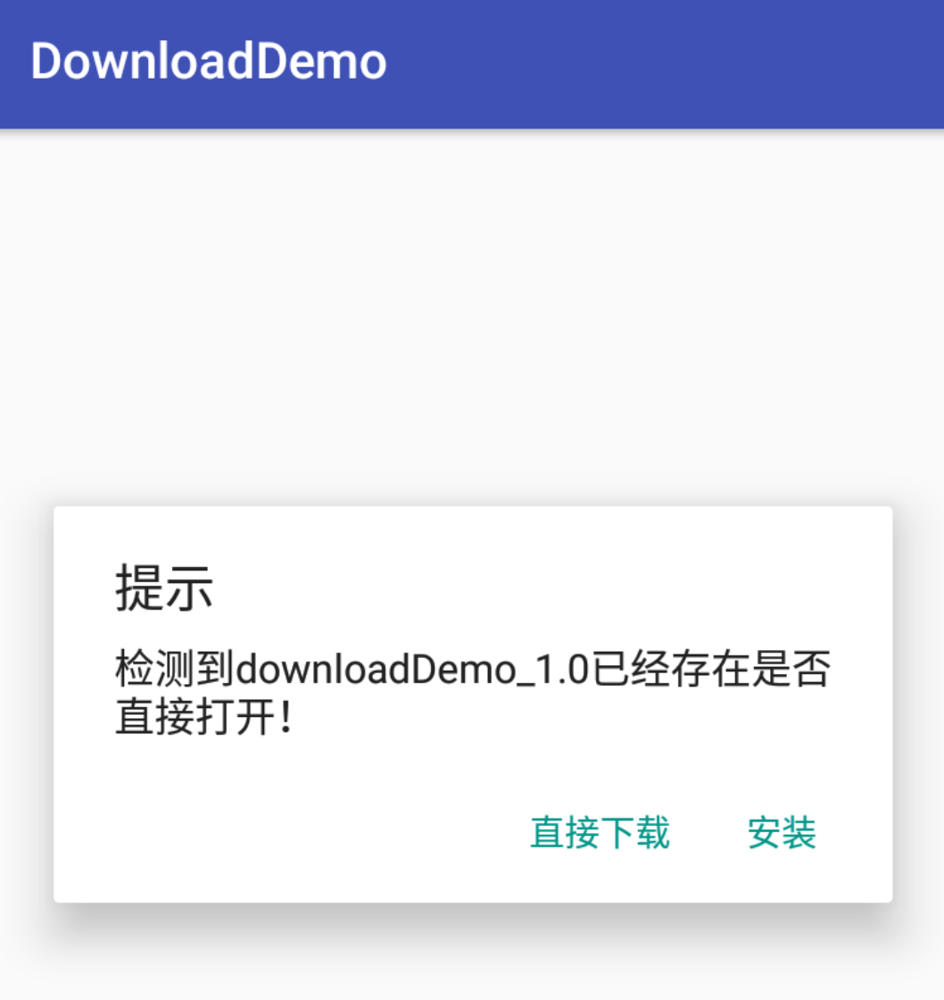

# KDownloadManager
下载apk并自动安装
```
1.intentService异步启动下载
2.支持系统DownloadManager和OkHttp下载切换
3.兼容系统DownloadManager被禁用时自动切换到OKHttp下载
4.系统下载可配置通知栏显示内容app名称和app版本号
4.可配置是否下载成功自动安装
5.支持7.0版本以上自动安装
```
```
new KDownloadManager.Builder(getApplicationContext())
        .setAppName("测试下载demo")
        .setApkName("downloadDemo")
        .setVersionName("1.0")
        .setApkDir(APPUtil.getDefaultInstallApkDir(MainActivity.this))
        .setInstall(true)
        .setSystemDownload(false)
        .setDownloadUrl("http://download.fir.im/v2/app/install/59b63f33548b7a28a000008b?download_token=36abfb0627d8ecd0ad3146c5aecf6f78&source=update")
        .start();
```



