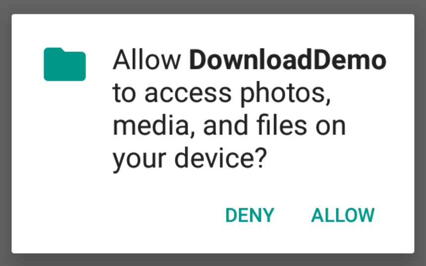
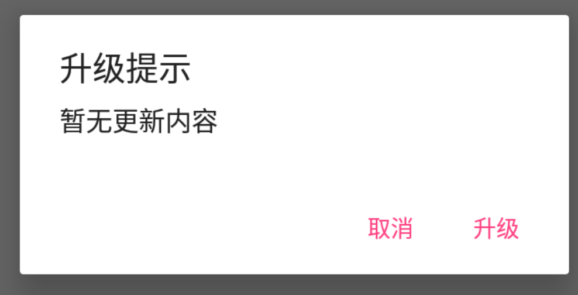
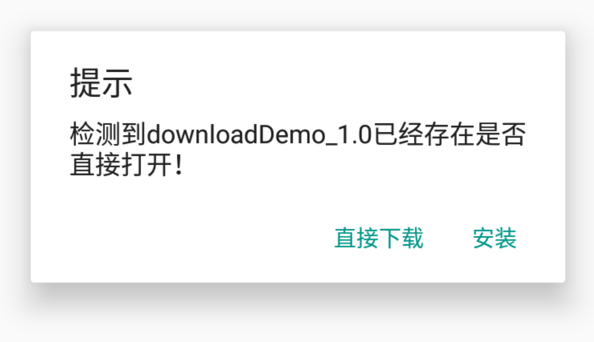
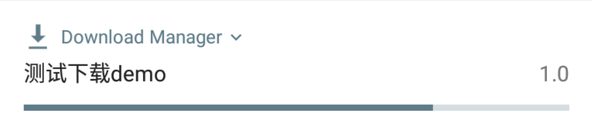
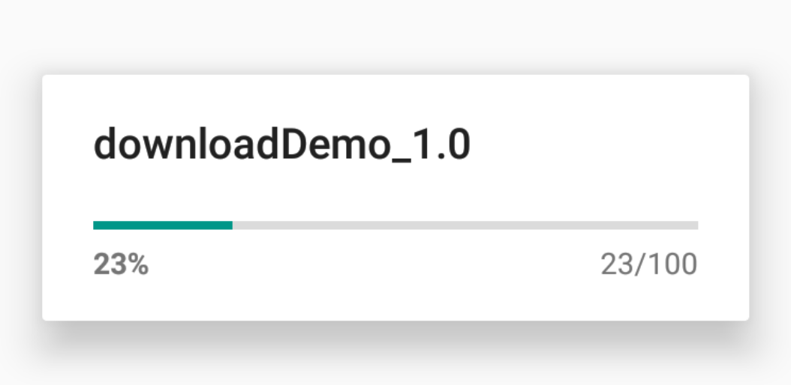

# KDownloader
Android 升级下载安装库

## Download
* 下载 [demo.apk](./demo.apk) <br/>

## Features
* 支持任何context上下文
* 支持版本升级提示框配置
* 支持自动权限检查
* intentService 异步启动下载
* 支持系统 DownloadManager 和 okhttp 下载切换
* 兼容系统 DownloadManager 被禁用时自动切换到 okhttp 下载
* 系统下载可配置通知栏显示内容 app 名称和 app 版本号
* 可配置是否下载成功自动安装
* 支持7.0版本以上自动安装

## Gradle
```
compile 'com.keyboard3:kdownloader:1.1.1'
```

## Usage
纯下载自动安装
```
new KDownloader.Builder(getApplicationContext())
        .setAppName("测试下载demo")
        .setApkName(APPUtil.getDefaultInstallApkName(getApplicationContext()))
        .setVersionName("1.0")
        //.setApkDir(APPUtil.getDefaultInstallApkDir(MainActivity.this))
        //.setInstall(true)
        //.setSystemDownload(false)
        .setDownloadUrl("http://download.fir.im/v2/app/install/59b63f33548b7a28a000008b?download_token=36abfb0627d8ecd0ad3146c5aecf6f78&source=update")
        .start();
```
带权限检查的升级提示框
```
new KDownloader.Builder(MainActivity.this)
        //.setDialogTitle("提示")
        //.setDialogMessage("新版本上线")
        //.setDialogForceShow(false)
        .setAppName("测试下载demo")
        .setApkName(APPUtil.getDefaultInstallApkName(getApplicationContext()))
        .setVersionName("1.0")
        //.setApkDir(APPUtil.getDefaultInstallApkDir(MainActivity.this))
        //.setInstall(true)
        .setSystemDownload(false)
        .setDownloadUrl("http://download.fir.im/v2/app/install/59b63f33548b7a28a000008b?download_token=36abfb0627d8ecd0ad3146c5aecf6f78&source=update")
        .startAndDialog();
```
## Screenshot






## Improve
* 不支持下载暂停
* 不支持多线程下载
* 还有很多其他尚未发现的缺陷和不足，欢迎提交 issue 和 PR

## Thanks
* okHttp 下载部分来自 [区长 CoreProgress](https://github.com/lizhangqu/CoreProgress)

## Author

简书 [keyboard3](http://www.jianshu.com/users/62329de8c8a6/latest_articles)<br>
邮箱 keyboard3@icloud.com

## License
<pre>
Licensed under the Apache License, Version 2.0 (the "License");
you may not use this file except in compliance with the License.
You may obtain a copy of the License at

   http://www.apache.org/licenses/LICENSE-2.0

Unless required by applicable law or agreed to in writing, software
distributed under the License is distributed on an "AS IS" BASIS,
WITHOUT WARRANTIES OR CONDITIONS OF ANY KIND, either express or implied.
See the License for the specific language governing permissions and
limitations under the License.
</pre>
